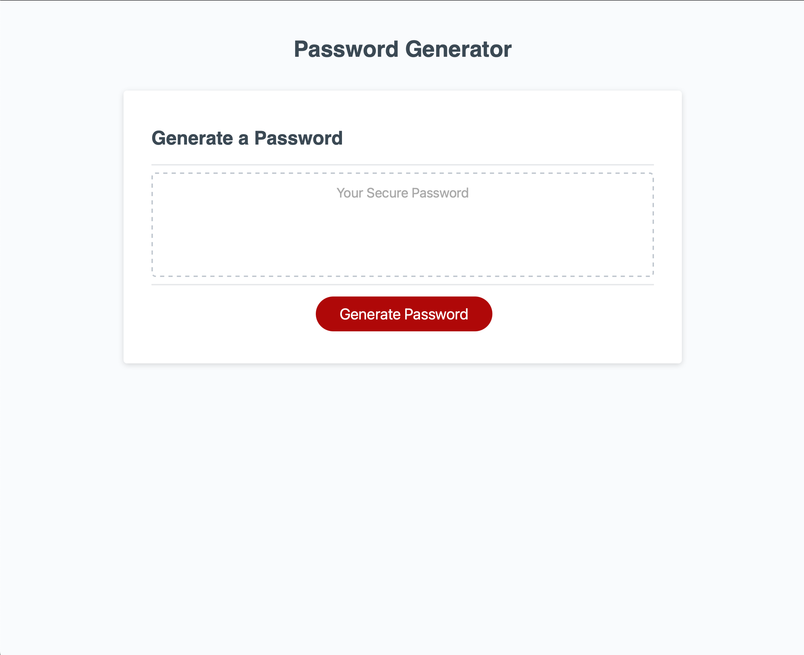
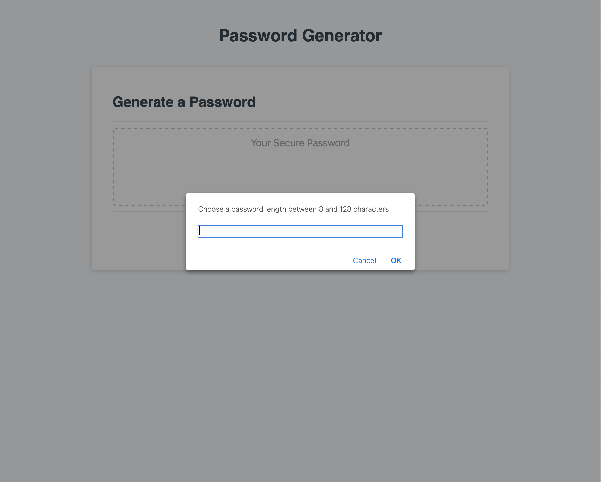
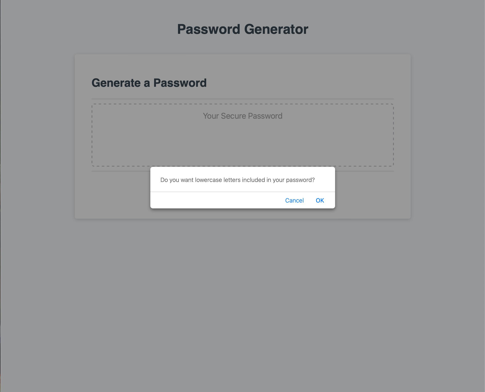

# Module 3 Challenge

## JavaScript Challenge: Password Generator

This application was created to allow a user to generate a random string of characters to use as a strong, secured password. It emphasizes the use of JavaScript in order for the user to interact with prompts to include different criteria for their randomly generated password.

## Usage

To use this web application, simply click on the "Generate Password" button

A prompt will come up asking the user to chose a number between 8 and 128.

If an invalid number is entered, an alert will pop up asking the user to enter a number between 8 and 128.

The window will then ask the user a set of criteria questions to include in their randomly generated password. Select "OK" for yes and "Cancel" for no.

After answering all the criteria questions, a randomly generated password using the user's criterias will appear in the box.

![Image of randomly generated password] (images/generatedPwd.png)

Link to deployed application: https://monicapong.github.io/challenge3

## License

Please refer to the GitHub Repository for licenstion information.

Link to GitHub repository: https://github.com/monicapong/challenge3